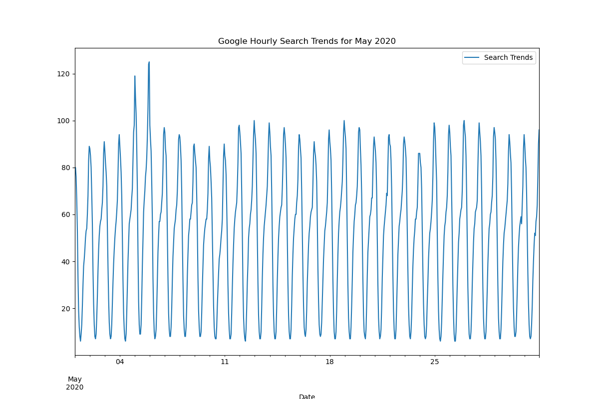

# Market Trend Analysis and Forecasting for MercadoLibre

I’m a growth analyst at [MercadoLibre](http://investor.mercadolibre.com/about-us), Latin America’s most popular e-commerce site with over 200 million users. In this project, I aimed to investigate if trends in Google search traffic for MercadoLibre could help predict stock price movements. By analyzing search and financial data, I explored whether search interest can serve as an indicator of company growth or stock trading opportunities.

The project consists of four main steps:

1. **Identify Unusual Patterns in Hourly Google Search Traffic**
2. **Analyze Seasonality in Search Traffic Data**
3. **Examine Relationships Between Search Traffic and Stock Price Patterns**
4. **Forecast Search Trends Using a Time Series Model with Prophet**

Each step is documented below, and I share insights from the analysis on seasonality and any links between search trends and stock performance.

---

## Requirements

To replicate the analysis, you’ll need the following Python libraries:

- `pandas` for data manipulation and cleaning
- `matplotlib` for plotting and visualization
- `prophet` (Prophet) for time series forecasting

Install these packages using:

```bash
pip install pandas matplotlib prophet
```

## Usage
To run the analysis:

1. Clone the repository:
    ```bash
    git clone https://github.com/jsaintfleur/prophet-challenge.git
    ```

2. Navigate to the project directory:
    ```bash
    cd prophet-challenge
    ```

3. Open and execute the Jupyter notebook:
    ```bash
    jupyter notebook forecasting_net_prophet.ipynb
    ```

4. Follow along with the code and review the output visualizations to understand the trends and forecasts.


## Project Steps and Analysis

### Step 1: Identify Unusual Patterns in Hourly Google Search Traffic

In this step, I examined whether unusual search patterns emerged around significant company events. I focused on May 2020, the month when MercadoLibre released its quarterly financial results, to see if there was a spike in search activity.




- **Findings**: The total search traffic for May 2020 was over twice the median monthly traffic. This indicates heightened interest around the time of financial results, suggesting that such events may drive search traffic.

### Step 2: Analyze Seasonality in Search Traffic Data

To optimize marketing efforts, I analyzed predictable seasonal patterns in search traffic, looking for times of peak user interest. I grouped the data by hour, day of the week, and week of the year:

- **By Hour of the Day**: Search traffic is highest late at night and early in the morning, peaking around midnight. It then declines steadily, reaching a low point around 5–6 AM. After this, traffic gradually increases throughout the day, rising again in the evening. This pattern suggests that users are more active online late at night and in the evening.  
  

- **By Day of the Week**: The average search traffic is highest at the start of the week, particularly on Monday and Tuesday. Traffic then gradually declines as the week progresses, with the lowest traffic observed on Saturdays and Sundays. This trend indicates that interest in the company may be higher during the workweek, possibly related to professional or financial activities that users engage in on weekdays.  
  

- **By Week of the Year**: Search traffic fluctuates throughout the year but shows increased activity during certain weeks, such as the early part of the year (around weeks 1–5) and towards the end of the year (weeks 40–52). This seasonal trend may indicate heightened interest during periods typically associated with financial reporting, holidays, or other significant events.  
  

These patterns suggest predictable periods of increased interest that could be leveraged for targeted marketing to maximize reach and ROI.


### Step 3: Examine Relationships Between Search Traffic and Stock Price Patterns

I investigated whether any correlation exists between search traffic and stock price. The figure below shows the time series data for MercadoLibre’s stock closing price from January 2015 to July 2020. To better understand if fluctuations in search traffic mirrored stock movements during key events, I will later narrow the focus to just the first half of 2020. This period includes significant market events that impacted global financial markets, providing an opportunity to explore any potential relationships between search traffic and stock price.


- **Initial Observations**: In the first half of 2020, both stock price and search traffic dropped in March, reflecting the initial shock to global financial markets. This decline, seen in both time series, aligns with significant market events that created global financial uncertainty. 

  After this initial decline, a steady recovery followed, with both stock prices and search interest showing an upward trend from April to June. This trend suggests that as demand for e-commerce grew, MercadoLibre’s market interest and financial performance improved. Search traffic notably increased in May, likely linked to the company’s financial recovery and growth. The figure below illustrates these trends, showing the relationship between stock price and search traffic from January to June 2020, supporting the narrative of resilience and growth in response to increased e-commerce demand.

  


- **Correlation Analysis**: To quantify the relationship, I created columns for "Lagged Search Trends," "Stock Volatility," and "Hourly Stock Return." The correlation results indicated a weak relationship between these variables, suggesting that while there may be some common trends, search traffic alone does not predict stock volatility or returns. The table below shows the correlation values:

  |                       | Stock Volatility | Lagged Search Trends | Hourly Stock Return |
  |-----------------------|------------------|-----------------------|----------------------|
  | **Stock Volatility**  | 1.000000        | -0.334698            | 0.025023            |
  | **Lagged Search Trends** | -0.334698    | 1.000000             | -0.004633           |
  | **Hourly Stock Return** | 0.025023     | -0.004633            | 1.000000            |

  These values confirm a lack of strong correlation, indicating that changes in search traffic have minimal predictive value for stock volatility or hourly returns.

  Additionally, the figure below visualizes stock volatility over time, showing fluctuations captured with a four-hour exponentially weighted rolling average.

  


### Step 4: Forecast Search Trends Using Prophet

Using Prophet, I built a time series model to forecast future search interest for MercadoLibre, examining daily, weekly, and yearly patterns. This forecast provides insights into expected search interest levels and identifies seasonal patterns that can inform targeted marketing strategies.

- **Forecast Insights**: The near-term forecast for MercadoLibre's popularity appears relatively stable, with search trends staying within a consistent range without significant spikes or drops. The forecasted trend line suggests that search interest will continue following a similar pattern as in previous periods, indicating stability in the short term with no anticipated major shifts.

- **Component Analysis**: The seasonal component plots provide further insights:
  - **Time of Day**: The daily component plot shows that search interest peaks around midnight (00:00), suggesting that users are most active in searching for MercadoLibre late at night.
  - **Day of the Week**: According to the weekly component plot, Tuesday experiences the highest search traffic, indicating a peak in user interest early in the workweek.
  - **Seasonal Low**: The yearly component plot reveals that search traffic reaches its lowest point around late September, indicating a seasonal dip in interest during this time of year.

These forecast and seasonal insights can help optimize marketing by focusing on periods with higher predicted search interest, allowing for more efficient resource allocation. By targeting peak times, days, and seasons, MercadoLibre can maximize its marketing impact and ROI.

  


## Repository Structure

```plaintext
.
├── forecasting_net_prophet.ipynb   # Jupyter Notebook containing the full analysis and code
├── README.md                       # Project README with detailed description
├── LICENSE (LICENSE)                          # The Project is under the MIT License.
└── Visuals/                          # This directory contains the various plots in the entire project

```

## Conclusion

This project provided a comprehensive analysis of MercadoLibre's search trends, uncovering key patterns across daily, weekly, and yearly cycles that are critical for informed marketing and engagement strategies. The data reveals that search interest is highest around midnight and peaks early in the workweek, specifically on Tuesdays. Seasonally, the lowest search activity occurs in late September, reflecting a predictable dip in user interest.

While the correlation analysis showed that search traffic alone does not strongly predict stock performance, the insights gained from the time series forecasting model using Prophet are invaluable. The stability in near-term search trends suggests consistent user interest, which allows for more confident planning and marketing allocation. By leveraging periods of high search interest, MercadoLibre can effectively time its campaigns to maximize engagement and ROI, aligning marketing efforts with user behavior patterns.

Overall, this analysis equips MercadoLibre with actionable insights into when their target audience is most engaged, supporting a more strategic, data-driven approach to both marketing and operational planning.


## License
This project is licensed under the MIT License. For more details, please see the LICENSE (LICENSE) file in the repository.
